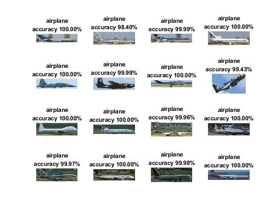
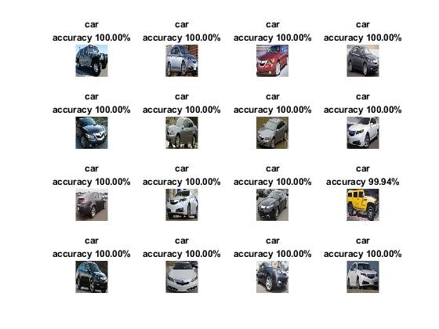

# Model  
Matlab
# Test
Use Alexnet accuracy 97.52%, Googlenet accurarcy 99.44, resnet50 accuracy 89.64% classify 1000 different categories.
# Type  
We only need six different types of transportation image to be validated
# Modify and Training process  

## 1.Delete matlab provided model with last 3 layers. 
prevent overfitting  
## 2.connect fully-connected layer, softmax layer, classification layer.
reduce model size and prevent overfitting

## 3.set imageAugmenter = imageDataAugmenter(...) mirroring, translation for imageDatastore to create dataset for augumented Train, validation.  

## 4.use Inputdata as 80% for train datastore, 20% for validation datastore.

## 5.setting trainingOptions : Initial learning rate, max epochs, mini batchsize.

## 6.start use net_Train = trainNetwork(augumented training datastore, layers, trainingoptions) to get train model(or net).  

## 7.use 20% validation datastore and the net just trained, with classify(net, validationdatastore) to get prediciton scores.
## 8.use mean(Ypred == imdsValidation.Labels) to get accuracy.

## 9.show the result below.

Target: This code is for objects recognition , you can use kaggle dataset.
Enviroment: Matlab
Training model: `googlenet_matlab.mat`

detail:
`validation_cnn.m` is validation program.
Do:
Just change `imagedatastore` 's parameter to your test image folder(input image) path.

other things you can do:
You can create another objects for training like cat, dog ...
ex. ../validation/cat/.. or ../validation/dog/.. 

